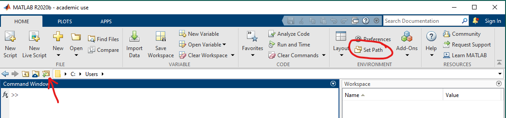
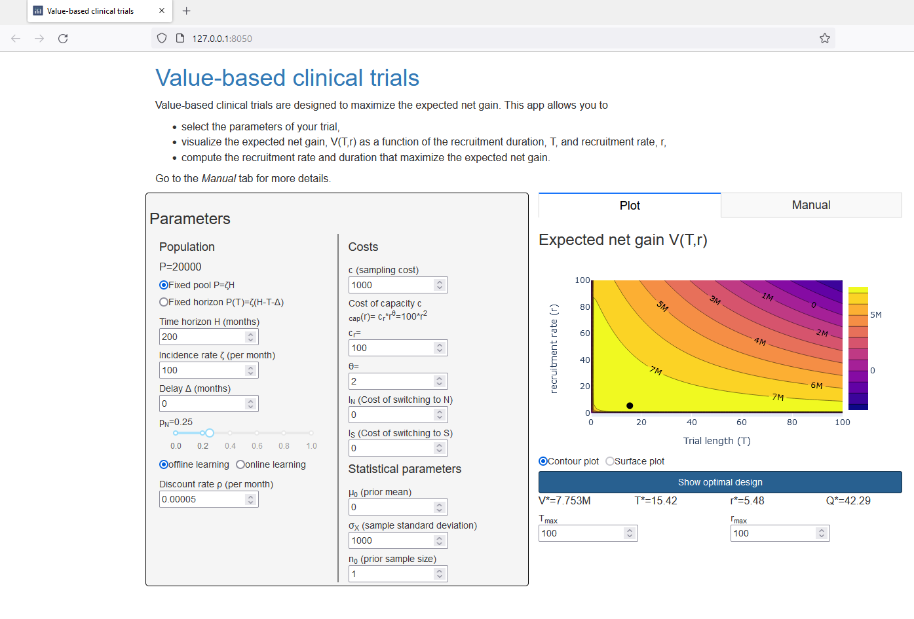

# ValueBasedTrials

This repository provides the code to replicate the results in 
1. Alban A, Chick SE, Foster M (2022) *Value-based Clinical Trials: Selecting Recruitment Rates and Trial Lengths in Different Regulatory Contexts*. Management Science, accepted to appear. (Working paper at https://ssrn.com/abstract=3914670)
2. Forster M, Brealey S, Chick SE, et al. (2021) *Cost-effective clinical trial design: Application of a Bayesian sequential model to the ProFHER pragmatic trial*. Clinical Trials 18(6):647-656. [doi:10.1177/17407745211032909](https://journals.sagepub.com/doi/10.1177/17407745211032909)

## Installation
The code is written in MATLAB and has been tested in versions 2019a and 2020b. It requires the optimization and statistics and machine learning toolboxes.

Save a copy of this repository (download, clone or fork) to your chosen local folder. Hereafter we shall refer to this repository as the *ValueBasedTrials* repository. Save a copy of the *htadelay* repository for sequential experimentation with delay [https://github.com/sechick/htadelay](https://github.com/sechick/htadelay).

You need to add the *Mixcore* folder in the *ValueBasedTrials* repository and the *delaycore* folder in the *htadelay* repository to your MATLAB path. On the MATLAB tabs at the top, go to  *HOME->ENVIRONMENT->Set Path* (see red circle in figure below). This will prompt a window with the folders in your MATLAB path. Click on *Add Folder...*, navigate to your local copy of the *Mixcore* folder, and click *Select Folder*. Repeat the same process to add *delaycore* subfolder of *htadelay* folder. The two subfolders should now appear at the top of your *MATLAB search path*. Click *Save* and *Close*. This will save the the path for future MATLAB sessions.



## Replicating Alban, Chick, Forster (2021)
To replicate the figures and tables in Alban, Chick, Forster (2021), you need to make the *mnscPaper* folder your working directory. To do so, click on the folder with a green arrow (indicated with a red arrow in the "Installation" section above). Then, navigate to the *mnscPaper* folder and click *Select Folder*. Open the file *mnscPaperDriver.m*. This script calls several other scripts that generate the tables and figures in the paper.
The first code section of *mscnPaperDriver.m* sets your preferences for saving figures. It must be run prior to running any other section. Once you have run the first section, run the file section-by-section (in any order you prefer) to create each figure. Each section starts with `%%`. Place the cursor on the section you want to run next and press `ctrl+enter` to run the section. You can check that it is working if you see "Busy" at the bottom left corner of the MATLAB window.

> Most sections finish within a minute but some take many hours. Read the comments for each section for any warnings about the duration.

### Data description
The results generated by the *mnscPaper/ProfherSetup_cost.m* script require the matlab data file *mnscPaper/Recruitment_by_site.mat*, which includes the number of randomized patients by site for the ProfHER trial as reported by Handoll et al. 2015 (page 37, [https://doi.org/10.3310/hta19240](https://doi.org/10.3310/hta19240)). The data set includes two columns:
1. Centre_id: the id of the recruitment center.
2. Randomised: the number of patients enrolled and randomized to a treatment arm by the recruitment center.

## Replicating Forster M, Brealey S, Chick S, et al. (2021)
To replicate the figures and tables in Forster M, Brealey S, Chick S, et al. (2021), you need to make the *ctPaper* folder your working directory. To do so, click on the folder with a green arrow (indicated with a red arrow in the "Installation" section above). Then, navigate to the *ctPaper* folder and click *Select Folder*. Open the file *ctPaperDriver.m*. After running this file, you will see all the figures in the main paper and the tables printed to the command window.

> Errata: Table 1 (section of Q_max=250) of Forster M, Brealey S, Chick S et al. (2021) report 250 and 510 in the maximum for "Sample size (pairwise allocations) - Monte Carlo" and "Change in Budget (£1000) - Monte Carlo", respectively, which is incorrect. The output for those entries provided by this MATLAB code is 187 and 253, which is correct.

### Data description
The bootstraping results rely on the data reported in Table SM.1 of the supplemental material included in the *ctPaper/data_blocks.csv* file. This file includes the QALYs and treatment costs for blocks of patients in the ProFHER trial. The columns are organized as follows:
1. Block id (0 represents the prior beliefs)
2. QALYs in the surgical arm
3. QALYs in the non-surgical arm
4. Treatment costs in the surgical arm
5. Treatment costs in the non-surgical arm
6. Number of QALY observations in the surgical arm
7. Number of QALY  observations in the non-surgical arm
8. Number of treatment cost observations in the surgical arm
9. Number of treatment cost observations in the non-surgical arm

## Basic usage to design your own one-shot value-based trial

The *ValueBasedTrials/Mixcore* folder provides several functions to compute the expected net gain of a value based trial and to search the trial length and recruitment rate that maximize the expected net gain. It also provides additional utilities for sensitivity analysis, comparative statics, and computation of asymptotes as the population goes to infinity.

The main building block of an analysis is a `basic` structure that contains the parameters of the trial. The function `MixInputConstructor` returns such a structure with default parameters. To modify parameters, you can pass a cell array with parameter-value pairs. For instance, to create a trial with a cost per patient `c=2000` and `Population=100000` we write (all other parameters are set to default values):
```matlab
basic = MixInputConstructor({'c',2000,'Population',100000});
```
Alternatively, we can modify an existing structure using `MixInputModifier`. The above statement is equivalent to
```matlab
basic = MixInputConstructor();
basic = MixInputModifier(basic,{'c',2000,'Population',100000});
```

All other functions take a `basic` structure as the first argument to define the trial parameters plus any additional arguments. For instance, `OneShotExpectedNetGain(basic,T,r)` computes the expected net gain of a trial with recruitment duration `T` and recruitment rate `r`. The function `OneShotMaxExpectedNetGain` computes the value-based design, i.e., the design that maximizes the expected net gain:
```matlab
[Designstar,ENGstar] = OneShotMaxExpectedNetGain(basic,globalsearch,optim_variables,iters,verbose);
```
The inputs are
- `basic`: structure defining trial parameters.
- `globalsearch`: if `true` optimizes with many random starting points. Default is `false`.
- `optim_variables`: if `'Tr'` optimizes both `T` (recruitment duration) and `r` (recruitment rate); if `'T'`, optimizes `T` only fixing the recruitment rate to `basic.r`; if `'r'`, optimizes `r` only fixing the recruitment duration to `basic.T`. Default is `'T'`.
- `iters`: number of iterations for a global search. Default is `100`.
- `verbose`: if `true`, prints warnings from the optimization algorithm. Default is `true`.

The outputs are
- `Designstar`: optimal decision variables. If `optimvariables='Tr'`, then this is a vector of length two, where the first entry is a the optimal recruitment duration T* and the second entry is the optimal recruitment rate r*. Otherwise, it is a scalar with the value of the optimized variable.
- `ENGstar`: the optimal expected net gain of the trial.

The easiest way to get started with additional functionalities is to go through the functions that replicate the results in the paper Alban, Chick, Forster (2021).

## Web application using Dash in Python
In addition to the matlab code, we provide code for an interactive web application that plots the expected net gain and the maximized decision variables. This app uses the [Dash](https://dash.plotly.com/introduction) framework in Python and requires additional installation. You need to have installed python 3.8 or higher. Here, we provide instructions to install using the package manager `pip`, shipped with the standard python installation at [https://www.python.org/downloads/](https://www.python.org/downloads/).

If you are on a unix machine (linux or MacOS), open the terminal. On Windows, open the powershell. Navigate to the *dash_app* folder in your local copy of the *ValueBasedTrials* repository (on Windows, you can open the *dash_app* folder in the file explorer, then go to *File* and *Open Windows PowerShell*).

We first create a virtual environment to install the required packages without contaminating your global installation. The following commands will create the environment in the *.venv* folder:
- Unix: `python3 -m venv .venv`
- Windows: `python -m venv .venv`

Next, we activate the environment:
- Unix: `source .venv/bin/activate`
- Windows: `.venv/Scripts/Activate.ps1`

To finish installation, we install the required packages using *pip*: 
- Unix: `python3 -m pip install -r requirements.txt`
- Windows: `python -m pip install -r requirements.txt`.

To finally run the app:
- Unix: `python3 app.py`
- Windows: `python app.py`

When you need to run the app again, you do not need to create the virtual environment and install the packages (it was already saved the first time you ran it). Only activate the environment and run the app.

If the app is running correctly, you should obtain the following message: `Dash is running on http://127.0.0.1:8050/` plus some additional information. Go to your browser (Chrome, Firefox, Edge, ...) and go to that address, in my case `http://127.0.0.1:8050/`. You should see the following:



## License
GNU General Public License v3.0. See full text in the *LICENSE* file.
